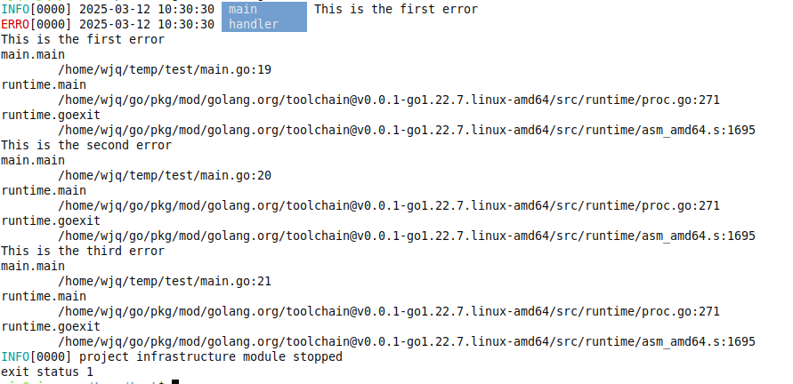

# infrastructure
Developing infrastructure for the Golang project

## Example
```golang
package main

import (
	"context"

	"github.com/just-lick-it/infrastructure"
	"github.com/pkg/errors"
)

func main() {
	infra, err := infrastructure.NewProjectInfrastructure(
		context.Background(),
		// only support "debug" "info" "warn" "error"
		infrastructure.WithLogLevel("debug"),
	)
	if err != nil {
		panic(err)
	}

	err = errors.New("This is the first error")
	err = errors.Wrap(err, "This is the second error")
	err = errors.Wrap(err, "This is the third error")

	// only print bottom error
	infra.ErrorTransmit("main", "info", err, false, false)

	// print error chain and exit
	infra.ErrorTransmit("handler", "error", err, true, true)
}
```

## How logs look like
